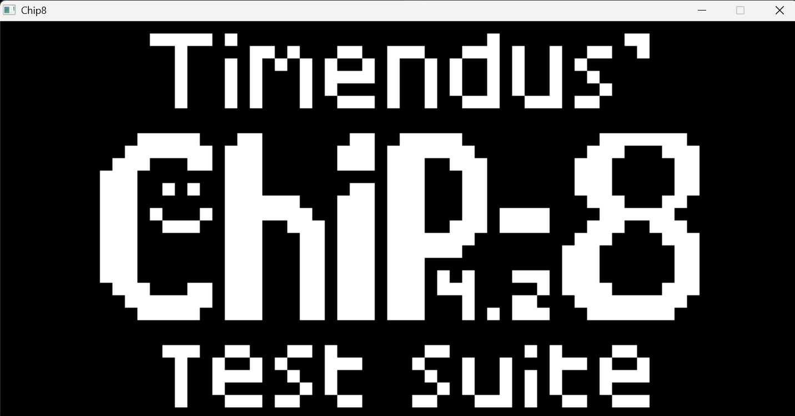

# chip8



[]()
[]()

**chip8** is a CHIP-8 interpreter written in C with SDL2.  
all 35 opcodes, passes corax+ and flags test suite.

---

## overview

CHIP-8 is a virtual machine from the 70s, originally built for the COSMAC VIP.  
4KB memory, 64×32 display, 16-key hex keypad, 35 opcodes.  
built this to understand how emulators work at the lowest level.

---

## build & run

**requirements:** gcc, SDL2

```bash
# linux / wsl
sudo apt install libsdl2-dev
gcc emulator.c -o chip8 -lmingw32 -lSDL2main -lSDL2     

# run
./chip8 <rom.ch8>
```

---

## controls

CHIP-8's hex keypad mapped to:

```
chip-8    keyboard
1 2 3 C   1 2 3 4
4 5 6 D   q w e r
7 8 9 E   a s d f
A 0 B F   z x c v
```

---

## tested with

| rom | result |
|---|---|
| ibm logo | ✓ |
| corax+ opcode test | ✓ |
| flags test | ✓ |
| pong, tetris, space invaders | ✓ |

---

## what i learned

- fetch → decode → execute is a clean mental model that scales to real CPUs
- bitmask operations are unavoidable at this level, you get comfortable fast
- timing matters more than you'd think — untimed CHIP-8 runs at thousands of cycles/sec
- the emudev community is really helpful!!

---

## references

- [tobias v. langhoff's guide](https://tobiasvl.github.io/blog/write-a-chip-8-emulator/)
- [cowgod's technical reference](http://devernay.free.fr/hacks/chip8/C8TECH10.HTM)
- [ctr errata by gulrak](https://github.com/gulrak/cadmium/wiki/CTR-Errata)
- [timendus test suite](https://github.com/Timendus/chip8-test-suite)

---

## license

MIT